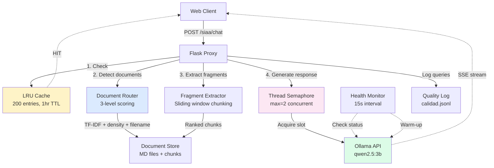

# System Architecture Overview

SIAA (Sistema Inteligente de Apoyo Administrativo) is an intelligent judicial document management system built for the Seccional Bucaramanga of Colombia's Judicial Branch. It uses AI-powered document routing and retrieval to answer queries about judicial procedures, regulations, and administrative processes.

## System Components



## Component Details

### Flask Proxy Server

The proxy server (`siaa_proxy.py`) acts as the central orchestrator, handling:
- Request routing and validation
- Cache management
- Document retrieval coordination
- Ollama API communication
- Quality monitoring and logging

<Info>
The proxy runs on **Waitress** WSGI server with 16 threads (`HILOS_SERVIDOR=16`) for production deployment.
</Info>

### Ollama LLM Engine

SIAA uses **Qwen2.5:3b** model via Ollama's local API:

```python siaa_proxy.py
OLLAMA_URL = "http://localhost:11434"
MODEL = "qwen2.5:3b"

# Model parameters
options = {
    "temperature": 0.0,        # Deterministic responses
    "num_predict": 150,        # Max tokens per response (300 for lists)
    "num_ctx": 2048,           # Context window (adaptive: 1024-3072)
    "num_thread": 6,           # Physical cores only (Ryzen 5 2600)
    "num_batch": 512,          # Large batch → lower TTFT
    "repeat_penalty": 1.1,
}
```

### Document Store

Documents are loaded from `/opt/siaa/fuentes` at startup:

```python siaa_proxy.py
CARPETA_FUENTES = "/opt/siaa/fuentes"

# Document structure
doc_entry = {
    "ruta": "/opt/siaa/fuentes/acuerdo_psaa16.md",
    "nombre_original": "acuerdo_psaa16.md",
    "contenido": "...",
    "palabras": set(),           # Tokenized vocabulary
    "tamano": 45231,             # Character count
    "coleccion": "general",
    "token_count": Counter(),    # Term frequency index
    "total_tokens": 1542,
    "tokens_nombre": {"acuerdo", "psaa16"},
    "num_chunks": 38,            # Pre-calculated chunks
}
```

### LRU Cache System

High-performance response cache with thread-safe LRU eviction:

```python siaa_proxy.py
CACHE_MAX_ENTRADAS = 200    # Maximum entries
CACHE_TTL_SEGUNDOS = 3600   # 1 hour TTL
CACHE_SOLO_DOC = True       # Only cache documentary queries

# Cache entry structure
{
    "respuesta": "El SIERJU es un sistema de información...",
    "cita": "📄 Fuente: ACUERDO PSAA16-10476",
    "ts": 1709856234.5,
    "hits": 12,
}
```

<Tip>
Cache hits provide **8,800x** speedup (~5ms vs 44s) and reduce Ollama load by 30-40% across 26 court offices.
</Tip>

## Data Flow: Query to Response

```mermaid
sequenceDiagram
    participant C as Client
    participant P as Proxy
    participant Cache as LRU Cache
    participant R as Router
    participant E as Extractor
    participant O as Ollama
    
    C->>P: POST /siaa/chat<br/>{messages: [...]}\n    P->>P: es_conversacion_general()?\n    alt Conversational query
        P->>O: SYSTEM_CONVERSACIONAL\n        O-->>C: Stream response (SSE)\n    else Documentary query
        P->>Cache: cache_get(pregunta)\n        alt Cache HIT
            Cache-->>C: Cached response (~5ms)\n        else Cache MISS
            P->>R: detectar_documentos(pregunta)\n            R->>R: Score: TF-IDF + density + filename\n            R-->>P: ["doc1.md", "doc2.md"]\n            loop For each document
                P->>E: extraer_fragmento(doc, pregunta)\n                E->>E: Rank chunks by relevance\n                E->>E: Apply dynamic pruning\n                E-->>P: Top 1-3 chunks (800 chars each)\n            end
            P->>O: SYSTEM_DOCUMENTAL + context\n            O-->>C: Stream response (SSE)\n            P->>Cache: cache_set(pregunta, respuesta)\n        end
    end
    P->>P: registrar_consulta() to JSONL log\n```

## Thread Management and Semaphores

SIAA uses careful concurrency control to prevent Ollama overload:

```python siaa_proxy.py
# Maximum concurrent Ollama requests
MAX_OLLAMA_SIMULTANEOS = 2
ollama_semaforo = threading.Semaphore(MAX_OLLAMA_SIMULTANEOS)

# Active user tracking
usuarios_activos = 0
total_atendidos = 0
contadores_lock = threading.Lock()

def inc_activos():
    global usuarios_activos, total_atendidos
    with contadores_lock:
        usuarios_activos += 1
        total_atendidos += 1

def llamar_ollama(mensajes, ...):
    # Block until semaphore slot available (30s timeout)
    adquirido = ollama_semaforo.acquire(timeout=30)
    if not adquirido:
        return ["COLA_LLENA"]
    
    try:
        # Make Ollama request
        resp = requests.post(...)
        # ... process streaming response
    finally:
        ollama_semaforo.release()
```

<Warning>
With `MAX_OLLAMA_SIMULTANEOS=2`, a 3rd concurrent request will wait up to 30 seconds. If the queue is full, users receive a "Sistema ocupado" message.
</Warning>

### Why Limit to 2 Concurrent Requests?

1. **RAM constraints**: Qwen2.5:3b requires ~4GB per instance
2. **CPU bottleneck**: Ryzen 5 2600 (6 cores) thrashes with >2 parallel inferences
3. **Response quality**: More concurrency = slower per-token generation

## Health Monitoring System

Automatic health checks run every 15 seconds:

```python siaa_proxy.py
ollama_estado = {
    "disponible": False,
    "ultimo_check": 0,
    "fallos": 0,
    "warmup_done": None
}

def verificar_ollama() -> bool:
    try:
        r = requests.get(f"{OLLAMA_URL}/api/tags", timeout=TIMEOUT_HEALTH)
        ok = (r.status_code == 200)
    except Exception:
        ok = False
    
    with ollama_lock:
        ollama_estado["disponible"] = ok
        ollama_estado["ultimo_check"] = time.time()
        ollama_estado["fallos"] = 0 if ok else ollama_estado["fallos"] + 1
        warmup_pendiente = ok and ollama_estado["warmup_done"] is None
    
    # Warm-up: load model into RAM on first success
    if warmup_pendiente:
        print(f"  [Ollama] Precargando {MODEL} en RAM...", flush=True)
        requests.post(
            f"{OLLAMA_URL}/api/chat",
            json={"model": MODEL, "messages": [{"role": "user", "content": "ok"}],
                  "stream": False, "options": {"num_predict": 1, "num_ctx": 64}}
        )
        ollama_estado["warmup_done"] = True
    
    return ok

# Background monitoring thread
def _monitor_loop():
    while True:
        verificar_ollama()
        time.sleep(15)

threading.Thread(target=_monitor_loop, daemon=True).start()
```

### Warm-up Process

On first successful connection, the monitor sends a minimal query (`"ok"` with 1 token prediction) to:
1. Load the model into RAM (prevents 30s delay on first real query)
2. Initialize CUDA/ROCm context
3. Verify model availability

<Card title="Check System Status" icon="chart-line">
```bash
curl http://localhost:5000/siaa/status
```

Returns health metrics including `warmup_completado`, `usuarios_activos`, cache stats, and Ollama availability.
</Card>

## Quality Monitoring and Logging

Every query is logged to `/opt/siaa/logs/calidad.jsonl` (JSONL format for easy analysis):

```python siaa_proxy.py
def registrar_consulta(
    tipo: str,          # "CONV", "DOC", "CACHE_HIT", "ERROR"
    pregunta: str,
    respuesta: str,
    docs: list,
    ctx_chars: int,
    tiempo_seg: float,
    cache_hit: bool = False,
):
    # Detect issues automatically
    no_encontro = "no encontré esa información" in respuesta.lower()
    habia_docs = len(docs) > 0 and ctx_chars > 100
    
    if no_encontro and habia_docs:
        alerta = "POSIBLE_ALUCINACION"   # Had docs but said "not found"
    elif no_encontro and not habia_docs:
        alerta = "SIN_CONTEXTO"           # No docs available (correct)
    elif tipo == "ERROR":
        alerta = "ERROR"
    else:
        alerta = "OK"
    
    entrada = {
        "ts": time.strftime("%Y-%m-%dT%H:%M:%S"),
        "tipo": "CACHE_HIT" if cache_hit else tipo,
        "alerta": alerta,
        "pregunta": pregunta[:200],
        "respuesta": respuesta[:300],
        "docs": docs,
        "ctx_chars": ctx_chars,
        "tiempo_s": round(tiempo_seg, 2),
    }
    
    # Write to JSONL with rotation at 5000 lines
    with _log_lock:
        with open(LOG_ARCHIVO, "a", encoding="utf-8") as f:
            f.write(json.dumps(entrada, ensure_ascii=False) + "\n")
```

### Hallucination Detection

The system automatically flags potential hallucinations:
- **POSIBLE_ALUCINACION**: Model said "no encontré" despite receiving relevant documents
- **SIN_CONTEXTO**: No documents found (expected "no encontré")

<Card title="View Quality Logs" icon="file-lines">
```bash
# Last 50 queries
curl http://localhost:5000/siaa/log

# Filter by alert type
curl http://localhost:5000/siaa/log?alerta=POSIBLE_ALUCINACION

# Text format for terminal
curl http://localhost:5000/siaa/log?n=20&formato=txt
```
</Card>

## Configuration Reference

| Parameter | Value | Purpose |
|-----------|-------|--------|
| `OLLAMA_URL` | `http://localhost:11434` | Ollama API endpoint |
| `MODEL` | `qwen2.5:3b` | LLM model identifier |
| `MAX_OLLAMA_SIMULTANEOS` | `2` | Concurrent Ollama requests |
| `HILOS_SERVIDOR` | `16` | Waitress worker threads |
| `TIMEOUT_CONEXION` | `8` | Connection timeout (seconds) |
| `TIMEOUT_RESPUESTA` | `180` | Response timeout (seconds) |
| `CARPETA_FUENTES` | `/opt/siaa/fuentes` | Document source directory |
| `MAX_DOCS_CONTEXTO` | `2` | Max documents per query |
| `CHUNK_SIZE` | `800` | Characters per chunk |
| `CHUNK_OVERLAP` | `300` | Overlap between chunks |
| `MAX_CHUNKS_CONTEXTO` | `3` | Max chunks per document |
| `CACHE_MAX_ENTRADAS` | `200` | Cache capacity |
| `CACHE_TTL_SEGUNDOS` | `3600` | Cache entry lifetime |
| `LOG_ARCHIVO` | `/opt/siaa/logs/calidad.jsonl` | Quality log path |
| `LOG_MAX_LINEAS` | `5000` | Log rotation threshold |

## Performance Characteristics

- **Cache hit**: ~5ms response time
- **Cache miss**: 20-45s response time (depending on context size)
- **TTFT** (Time To First Token): 3-8s with warm model
- **Token generation**: ~15-20 tokens/second
- **Max throughput**: 2 concurrent users (semaphore limit)
- **Cache hit rate**: 30-40% (across 26 court offices)

## API Endpoints

| Endpoint | Method | Description |
|----------|--------|-------------|
| `/siaa/chat` | POST | Main chat interface (SSE streaming) |
| `/siaa/status` | GET | System health and statistics |
| `/siaa/ver/<doc>` | GET | View document as HTML |
| `/siaa/log` | GET | Quality monitoring log |
| `/siaa/cache` | GET/DELETE | Cache statistics / clear cache |
| `/siaa/enrutar` | GET | Test document routing |
| `/siaa/fragmento` | GET | View extracted fragment |
| `/siaa/recargar` | GET | Reload documents from disk |

<Card title="Next Steps" icon="arrow-right">
- Learn about the [document routing algorithm](/architecture/document-routing)
- Understand [chunking strategies](/architecture/chunking)
- Explore [Ollama integration](/architecture/ollama-integration)
</Card>