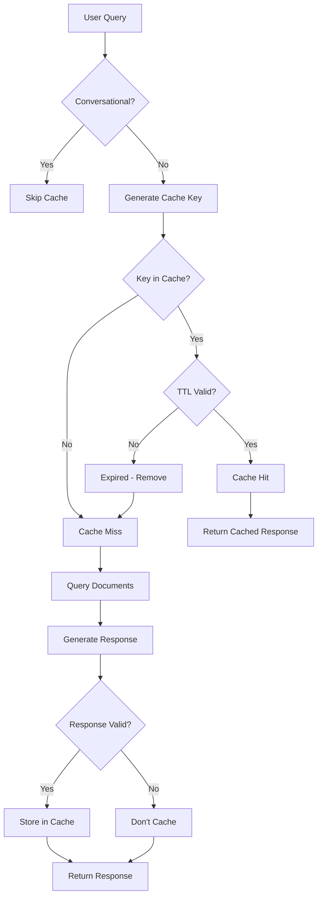

SIAA implements a thread-safe LRU (Least Recently Used) cache that stores complete responses to frequent document queries. The cache can deliver responses in ~5ms compared to 44 seconds for uncached queries—an **8,800x speedup**.

## Overview

The cache system is designed specifically for the judicial environment where 26 departments ask similar questions repeatedly.



## Cache Configuration

```python siaa_proxy.py:61-63
CACHE_MAX_ENTRADAS = 200    # Maximum stored responses
CACHE_TTL_SEGUNDOS = 3600   # 1 hour — lifetime per entry
CACHE_SOLO_DOC     = True   # Only cache document queries (not greetings)
```

<ParamField path="CACHE_MAX_ENTRADAS" type="int" default="200">
  Maximum number of cached responses. When full, the least recently used entry is evicted.
</ParamField>

<ParamField path="CACHE_TTL_SEGUNDOS" type="int" default="3600">
  Time-to-live in seconds. Entries older than this are considered stale and removed.
</ParamField>

<ParamField path="CACHE_SOLO_DOC" type="bool" default="true">
  When true, only document queries are cached. Conversational queries (greetings, small talk) are always processed fresh.
</ParamField>

## Cache Entry Structure

Each cache entry contains:

```python siaa_proxy.py:65-66
# Estructura de cada entrada del caché:
# { "respuesta": str, "cita": str, "ts": float, "hits": int }
```

<ResponseField name="respuesta" type="string">
  Complete response text from the AI model
</ResponseField>

<ResponseField name="cita" type="string">
  Source citation with document links (e.g., "📄 Fuente: PSAA16-10476")
</ResponseField>

<ResponseField name="ts" type="float">
  Timestamp when entry was created/updated (Unix time)
</ResponseField>

<ResponseField name="hits" type="int">
  Number of times this entry was retrieved (LRU tracking)
</ResponseField>

## Cache Key Generation

The cache key is generated from a normalized version of the query to ensure variations of the same question hit the cache.

### Normalization Algorithm

<CodeGroup>
```python siaa_proxy.py:73-86
def _clave_cache(texto: str) -> str:
    """
    Genera clave de caché normalizada — insensible a tildes, puntuación y mayúsculas.
    "¿Cuándo debo reportar?" == "cuando debo reportar" == "CUANDO DEBO REPORTAR"
    """
    import unicodedata
    t = texto.lower()
    t = re.sub(r'[^\w\s]', '', t)  # Remove punctuation
    # Remove accents: "cuándo" → "cuando", "información" → "informacion"
    t = ''.join(c for c in unicodedata.normalize('NFD', t)
                if unicodedata.category(c) != 'Mn')
    t = re.sub(r'\s+', ' ', t).strip()
    return hashlib.sha256(t.encode()).hexdigest()[:16]
```
</CodeGroup>

### Normalization Steps

<Steps>
  <Step title="Lowercase">
    `"CUÁNDO"` → `"cuándo"`
  </Step>
  
  <Step title="Remove Punctuation">
    `"¿Cuándo debo reportar?"` → `"Cuándo debo reportar"`
  </Step>
  
  <Step title="Remove Accents">
    `"cuándo"` → `"cuando"`, `"información"` → `"informacion"`
  </Step>
  
  <Step title="Normalize Whitespace">
    `"cuando  debo    reportar"` → `"cuando debo reportar"`
  </Step>
  
  <Step title="SHA-256 Hash">
    `"cuando debo reportar"` → `"a7f3c8e9b2d14f56"` (first 16 chars)
  </Step>
</Steps>

### Equivalent Queries

All these variations produce the same cache key:

```
¿Cuándo debo reportar?
CUÁNDO DEBO REPORTAR
cuando debo reportar
¿¿¿Cuándo... debo reportar???
```

Cache key: `a7f3c8e9b2d14f56`

## Cache Operations

### Cache Get (Retrieval)

<CodeGroup>
```python siaa_proxy.py:88-116
def cache_get(pregunta: str) -> dict | None:
    """
    Busca la pregunta en el caché.

    Returns:
        dict con {respuesta, cita} si hay hit válido, None si miss o expirado.
    """
    global _cache_hits, _cache_misses
    clave = _clave_cache(pregunta)

    with _cache_lock:
        if clave not in _cache_respuestas:
            _cache_misses += 1
            return None

        entrada = _cache_respuestas[clave]

        # Verificar TTL
        if time.time() - entrada["ts"] > CACHE_TTL_SEGUNDOS:
            del _cache_respuestas[clave]
            _cache_misses += 1
            return None

        # HIT — mover al final (LRU: más recientemente usado)
        _cache_respuestas.move_to_end(clave)
        entrada["hits"] += 1
        _cache_hits += 1
        return {"respuesta": entrada["respuesta"], "cita": entrada["cita"]}
```
</CodeGroup>

**Behavior**:
1. Generate normalized cache key
2. Check if key exists in cache
3. If exists, verify TTL hasn't expired
4. If valid, move entry to end of OrderedDict (LRU bookkeeping)
5. Increment hit counter
6. Return response and citation

<Note>
The LRU mechanism uses Python's `OrderedDict.move_to_end()` to track recency. Most recently accessed items move to the end; when evicting, the first item (least recent) is removed.
</Note>

### Cache Set (Storage)

<CodeGroup>
```python siaa_proxy.py:118-148
def cache_set(pregunta: str, respuesta: str, cita: str):
    """
    Guarda una respuesta en el caché.
    Si el caché está lleno, desaloja la entrada menos usada (la del frente).
    """
    if not respuesta.strip():
        return  # No cachear respuestas vacías

    # No cachear respuestas de "no encontré" — son negativas y pueden cambiar
    if "no encontré esa información" in respuesta.lower():
        return

    clave = _clave_cache(pregunta)
    with _cache_lock:
        # Si ya existe, actualizar
        if clave in _cache_respuestas:
            _cache_respuestas.move_to_end(clave)
            _cache_respuestas[clave].update({"respuesta": respuesta, "cita": cita, "ts": time.time()})
            return

        # Si está lleno, desalojar el más antiguo (frente del OrderedDict)
        while len(_cache_respuestas) >= CACHE_MAX_ENTRADAS:
            _cache_respuestas.popitem(last=False)

        _cache_respuestas[clave] = {
            "respuesta": respuesta,
            "cita":      cita,
            "ts":        time.time(),
            "hits":      0,
        }
```
</CodeGroup>

**Storage Rules**:
- ❌ Don't cache empty responses
- ❌ Don't cache "no encontré esa información" (negative results may change)
- ✅ Update existing entries (refresh timestamp)
- ✅ Evict oldest entry when cache is full

<Warning>
Negative results ("no encontré") are **not cached** because they may become outdated when documents are updated. A query that returns no results today might have a valid answer tomorrow.
</Warning>

### Cache Statistics

<CodeGroup>
```python siaa_proxy.py:150-163
def cache_stats() -> dict:
    """Estadísticas del caché para el endpoint /siaa/status."""
    with _cache_lock:
        total   = _cache_hits + _cache_misses
        hit_rate = round(_cache_hits / total * 100, 1) if total > 0 else 0
        return {
            "entradas":  len(_cache_respuestas),
            "max":       CACHE_MAX_ENTRADAS,
            "hits":      _cache_hits,
            "misses":    _cache_misses,
            "hit_rate":  f"{hit_rate}%",
            "ttl_seg":   CACHE_TTL_SEGUNDOS,
        }
```
</CodeGroup>

## When Caching Happens

### Conversational vs. Document Queries

The system distinguishes between two query types:

<CodeGroup>
```python siaa_proxy.py:379-388
def es_conversacion_general(texto: str) -> bool:
    t = texto.lower().strip()
    # If contains technical/judicial term → ALWAYS document query
    if any(term in t for term in TERMINOS_SIEMPRE_DOCUMENTAL):
        return False
    # Ultra-short phrases are greetings
    if len(t) < 8:
        return True
    return any(p in t for p in PATRONES_CONVERSACION)
```
</CodeGroup>

<CardGroup cols={2}>
  <Card title="Document Queries" icon="file-lines">
    **Cached** ✅
    
    - "¿Cuándo debo reportar al SIERJU?"
    - "¿Qué es el PSAA16?"
    - "Consecuencias por no reportar"
    
    These are deterministic and benefit from caching.
  </Card>
  
  <Card title="Conversational" icon="message">
    **Not Cached** ❌
    
    - "Hola"
    - "Buenos días"
    - "Gracias"
    - "¿Quién eres?"
    
    These are context-dependent and change each time.
  </Card>
</CardGroup>

### Cache Check Flow

```python siaa_proxy.py:1486-1523
# Only for document queries
if not es_conv and CACHE_SOLO_DOC:
    hit = cache_get(ultima_pregunta)
    if hit:
        print(
            f"[CACHÉ HIT] pregunta={ultima_pregunta[:50]!r} "
            f"stats={cache_stats()}",
            flush=True
        )
        registrar_consulta(
            tipo="DOC", pregunta=ultima_pregunta,
            respuesta=hit["respuesta"], docs=[],
            ctx_chars=0, tiempo_seg=0.0, cache_hit=True
        )
        # Return cached response immediately
        return Response(
            stream_with_context(_stream_cached()),
            content_type="text/event-stream",
            headers={"X-Cache": "HIT"}
        )
```

## Cache Response Delivery

Cached responses are delivered via Server-Sent Events (SSE) with simulated streaming:

```python siaa_proxy.py:1505-1516
def _stream_cached():
    # Send response token by token to simulate streaming
    chunk_size = 40  # chars per "token"
    for i in range(0, len(respuesta_cached), chunk_size):
        trozo = respuesta_cached[i:i+chunk_size]
        safe  = json.dumps(trozo)[1:-1]
        yield f'data: {{"choices":[{{"delta":{{"content":"{safe}"}}}}]}}\n\n'
    if cita_cached:
        safe_cita = json.dumps(cita_cached)[1:-1]
        yield f'data: {{"choices":[{{"delta":{{"content":"{safe_cita}"}}}}]}}\n\n'
    yield "data: [DONE]\n\n"
```

<Info>
Although the response is pre-computed, it's sent in chunks to maintain compatibility with the streaming UI. This creates a smooth typing effect even for instant cache hits.
</Info>

## Performance Impact

### Expected Metrics

<CardGroup cols={2}>
  <Card title="Cache Hit Time" icon="bolt">
    **~5 milliseconds**
    
    In-memory lookup + streaming delivery
  </Card>
  
  <Card title="Cache Miss Time" icon="hourglass">
    **~25-45 seconds**
    
    Document routing + chunk scoring + model inference
  </Card>
  
  <Card title="Hit Rate (Estimated)" icon="percent">
    **30-40%**
    
    26 departments asking similar questions
  </Card>
  
  <Card title="Speedup Factor" icon="rocket">
    **8,800x faster**
    
    5ms vs 44s for identical queries
  </Card>
</CardGroup>

### Real-World Example

**Scenario**: 26 judicial departments all ask "¿Cuándo debo reportar al SIERJU?"

| Query # | Cache Status | Time | Resource Usage |
|---------|--------------|------|----------------|
| 1st | Miss | 38s | Full: routing + chunks + model |
| 2nd-26th | Hit | 5ms each | Zero: memory lookup only |

**Total time saved**: 25 queries × 38s = **950 seconds** (15.8 minutes)

## Thread Safety

All cache operations are protected by a lock:

```python siaa_proxy.py:67-70
_cache_respuestas = OrderedDict()
_cache_lock       = threading.Lock()
_cache_hits       = 0
_cache_misses     = 0
```

Essential in a multi-threaded environment with up to 16 concurrent requests.

## Cache Management Endpoints

### View Cache Statistics

```bash
curl http://localhost:5000/siaa/cache
```

Response:
```json
{
  "entradas": 47,
  "max": 200,
  "hits": 152,
  "misses": 89,
  "hit_rate": "63.1%",
  "ttl_seg": 3600
}
```

### Clear Cache

```bash
curl -X DELETE http://localhost:5000/siaa/cache
```

Response:
```json
{
  "vaciado": true,
  "mensaje": "Caché limpiado correctamente"
}
```

<Warning>
Clear the cache after updating documents to ensure users don't receive outdated cached responses.
</Warning>

### Cache Status in Headers

Cached responses include a header:

```http
HTTP/1.1 200 OK
Content-Type: text/event-stream
X-Cache: HIT
```

## Quality Logging

Cache hits are logged separately for monitoring:

```python siaa_proxy.py:1496-1500
registrar_consulta(
    tipo="DOC", pregunta=ultima_pregunta,
    respuesta=hit["respuesta"], docs=[],
    ctx_chars=0, tiempo_seg=0.0, cache_hit=True
)
```

Log entry:
```json
{
  "ts": "2026-03-08T14:23:45",
  "tipo": "CACHE_HIT",
  "alerta": "OK",
  "pregunta": "cuando debo reportar al sierju",
  "respuesta": "Debe reportar antes del quinto día hábil...",
  "docs": [],
  "ctx_chars": 0,
  "tiempo_s": 0.0
}
```

## Best Practices

<AccordionGroup>
  <Accordion title="Cache Size Tuning">
    **Default: 200 entries** is appropriate for 20-30 departments.
    
    **Increase** `CACHE_MAX_ENTRADAS` if:
    - You have &gt;50 departments
    - Users ask many unique but frequent questions
    - You have &gt;10 GB RAM available
    
    **Decrease** if:
    - Memory is constrained (&lt;4 GB)
    - Hit rate is consistently &lt;20%
    - Document updates are very frequent
    
    **Memory estimate**: ~5 KB per entry → 200 entries ≈ 1 MB
  </Accordion>
  
  <Accordion title="TTL Configuration">
    **Default: 3600s (1 hour)** balances freshness and performance.
    
    **Increase** TTL to 7200-14400s (2-4 hours) if:
    - Documents rarely change
    - You want maximum cache efficiency
    - Questions are highly repetitive
    
    **Decrease** TTL to 1800s (30 min) if:
    - Documents update frequently
    - Regulatory content changes often
    - You prioritize freshness over speed
  </Accordion>
  
  <Accordion title="Cache Invalidation Strategy">
    **Automatic**: Clear cache after document updates
    
    ```bash
    # After updating documents
    python3 convertidor.py
    curl -X DELETE http://localhost:5000/siaa/cache
    curl http://localhost:5000/siaa/recargar
    ```
    
    **Scheduled**: Clear cache nightly if documents update daily
    
    ```bash
    # Cron job: daily at 2 AM
    0 2 * * * curl -X DELETE http://localhost:5000/siaa/cache
    ```
  </Accordion>
  
  <Accordion title="Monitoring Cache Health">
    Track these metrics:
    
    - **Hit rate**: Should be &gt;30% after warm-up period
    - **Entry count**: Should stay below max (indicates cache isn't thrashing)
    - **Avg response time**: Cache hits should be &lt;10ms
    
    ```bash
    # Monitor continuously
    watch -n 5 'curl -s http://localhost:5000/siaa/cache | jq .'
    ```
    
    Low hit rate (&lt;20%) may indicate:
    - Questions are too diverse (consider increasing max entries)
    - TTL is too short (responses expire before re-use)
    - Most queries are conversational (expected — not cached)
  </Accordion>
</AccordionGroup>

## Implementation Notes

<Note>
**Why OrderedDict?** Python's `OrderedDict` maintains insertion order and provides `move_to_end()` for efficient LRU tracking without a separate linked list.
</Note>

<Note>
**Why not Redis?** For a single-server deployment with &lt;1000 entries, an in-memory LRU cache is simpler and faster than a separate Redis instance. The entire cache fits in &lt;5 MB of RAM.
</Note>

<Note>
**Why normalize accents?** Spanish queries like "información" and "informacion" should hit the same cache entry. NFD normalization removes diacritical marks for consistent hashing.
</Note>