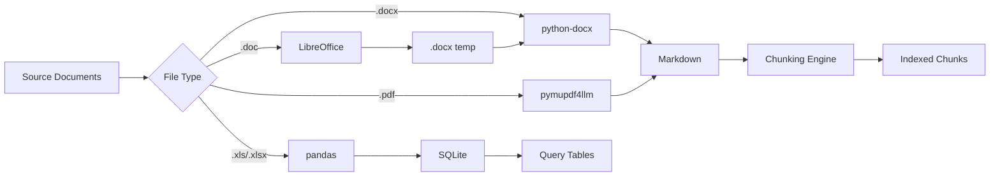

SIAA automatically processes judicial documents from multiple formats into searchable, AI-ready formats. The pipeline converts Word and PDF files to Markdown, Excel files to SQLite tables, and generates optimized chunks with overlap for semantic search.

## Overview

The document processing pipeline handles three main workflows:



## Supported Formats

<CardGroup cols={3}>
  <Card title="Word Documents" icon="file-word">
    `.doc`, `.docx`
    
    Converted via LibreOffice + python-docx
  </Card>
  
  <Card title="PDF Documents" icon="file-pdf">
    `.pdf`
    
    Converted via pymupdf4llm or LibreOffice
  </Card>
  
  <Card title="Excel Spreadsheets" icon="file-excel">
    `.xls`, `.xlsx`
    
    Loaded into SQLite tables
  </Card>
</CardGroup>

## Conversion Pipeline

### Word to Markdown (.docx)

Direct conversion using python-docx preserves document structure:

<CodeGroup>
```python convertidor.py:144-179
def docx_to_markdown(docx_path: Path, folder_name: str) -> tuple[bool, str]:
    """Extrae texto y tablas de .docx a Markdown usando python-docx."""
    if docx is None:
        return False, "python-docx no instalado"

    document = docx.Document(str(docx_path))
    lines: list[str] = [f"# {folder_name}", ""]

    # Extract paragraphs with heading detection
    for paragraph in document.paragraphs:
        text = paragraph.text.strip()
        if not text:
            continue
        style_name = (paragraph.style.name or "").lower()
        if "heading" in style_name:
            level_match = re.search(r"(\d+)", style_name)
            level = int(level_match.group(1)) if level_match else 2
            level = max(1, min(level, 6))
            lines.extend([f"{'#' * level} {text}", ""])
        else:
            lines.extend([text, ""])

    # Extract tables as Markdown tables
    for table in document.tables:
        table_rows = [[_safe_cell(cell.text) for cell in row.cells] 
                      for row in table.rows]
        md_table = markdown_table(table_rows)
        if md_table:
            lines.extend([md_table, ""])

    return True, "\n".join(lines).strip() + "\n"
```
</CodeGroup>

**Features**:
- Preserves heading hierarchy (H1-H6)
- Converts tables to Markdown table format
- Escapes special characters in cells
- Maintains paragraph structure

### Legacy Word (.doc) via LibreOffice

Older `.doc` files are converted through LibreOffice headless:

<CodeGroup>
```python convertidor.py:211-269
def convert_to_docx_via_libreoffice(input_path: Path, output_dir: Path) -> tuple[bool, Path | None, str]:
    """
    Convierte .doc o .pdf a .docx usando LibreOffice headless.
    Reemplaza la función de PowerShell + Word COM usada en Windows.
    """
    output_dir.mkdir(parents=True, exist_ok=True)

    if not _libreoffice_disponible():
        return False, None, (
            "LibreOffice no está instalado. "
            "Instale con: sudo dnf install libreoffice-headless"
        )

    cmd = [
        _cmd_libreoffice(),
        "--headless",
        "--norestore",
        "--convert-to", "docx",
        "--outdir", str(output_dir),
        str(input_path),
    ]

    try:
        result = subprocess.run(
            cmd,
            capture_output=True,
            text=True,
            timeout=120   # 2 minutes max per file
        )
    except subprocess.TimeoutExpired:
        return False, None, "LibreOffice tardó más de 2 minutos"

    if result.returncode != 0:
        detalle = result.stderr.strip() or result.stdout.strip()
        return False, None, f"LibreOffice error: {detalle[:200]}"

    # Find generated .docx file
    docx_esperado = output_dir / (input_path.stem + ".docx")
    if not docx_esperado.exists():
        candidatos = list(output_dir.glob("*.docx"))
        if candidatos:
            docx_esperado = max(candidatos, key=lambda p: p.stat().st_mtime)
        else:
            return False, None, "LibreOffice no generó archivo .docx"

    return True, docx_esperado, "Conversión completada"
```
</CodeGroup>

<Note>
**Linux vs. Windows**: The Windows version used PowerShell + Word COM automation. The Linux version uses LibreOffice headless, which doesn't require Microsoft Office.
</Note>

**Installation** (Fedora/RHEL):
```bash
sudo dnf install libreoffice-headless
```

### PDF to Markdown

PDFs are converted using pymupdf4llm with LibreOffice as fallback:

<CodeGroup>
```python convertidor.py:271-284
def convert_pdf_directo(pdf_path: Path) -> tuple[bool, str]:
    """
    Fallback: convierte PDF directamente a Markdown con pymupdf4llm,
    sin pasar por .docx. Más fiel para PDFs con tablas complejas.
    """
    try:
        import pymupdf4llm
        md_text = pymupdf4llm.to_markdown(str(pdf_path))
        return True, md_text
    except ImportError:
        return False, "pymupdf4llm no instalado"
    except Exception as e:
        return False, f"Error en pymupdf4llm: {e}"
```
</CodeGroup>

**Conversion Strategy**:
1. **Primary**: pymupdf4llm (direct PDF → Markdown, better table preservation)
2. **Fallback**: LibreOffice → .docx → python-docx (if pymupdf4llm fails)

<Tip>
pymupdf4llm preserves complex tables and formatting better than the two-step LibreOffice conversion. It's the recommended method for PDF processing.
</Tip>

### Excel to SQLite

Spreadsheets are loaded into SQLite tables for structured queries:

<CodeGroup>
```python convertidor.py:377-393
def excel_to_sqlite(excel_path: Path, conn: sqlite3.Connection,
                    table_name: str) -> tuple[bool, int, str]:
    suffix = excel_path.suffix.lower()
    if suffix not in (".xls", ".xlsx"):
        return False, 0, f"Extensión no soportada: {suffix}"
    
    try:
        engine = "xlrd" if suffix == ".xls" else "openpyxl"
        df = pd.read_excel(excel_path, engine=engine)
    except Exception as exc:
        return False, 0, f"No se pudo leer Excel: {exc}"

    # Sanitize column names
    cleaned = [sanitize_column(c) for c in df.columns.tolist()]
    df.columns = make_unique_columns(cleaned)
    
    conn.execute(f'DROP TABLE IF EXISTS "{table_name}"')
    df.to_sql(table_name, conn, if_exists="replace", index=False)
    return True, int(len(df)), "Tabla creada/reemplazada"
```
</CodeGroup>

**Column Name Sanitization**:
```python convertidor.py:94-115
def slugify_ascii(name: str) -> str:
    normalized = unicodedata.normalize("NFKD", name)
    ascii_only = normalized.encode("ascii", "ignore").decode("ascii")
    collapsed  = re.sub(r"[\s\-/]+", "_", ascii_only.lower())
    cleaned    = re.sub(r"[^a-z0-9_]", "", collapsed)
    cleaned    = re.sub(r"_+", "_", cleaned).strip("_")
    return cleaned or "sin_nombre"

def make_unique_columns(columns: list[str]) -> list[str]:
    used:   dict[str, int] = {}
    unique: list[str]      = []
    for col in columns:
        base  = col or "columna"
        count = used.get(base, 0) + 1
        used[base] = count
        unique.append(base if count == 1 else f"{base}_{count}")
    return unique
```

## Chunking with Overlap

Markdown documents are split into fixed-size chunks with overlap to preserve context.

### Chunking Algorithm

<CodeGroup>
```python siaa_proxy.py:669-705
def chunking_con_solapamiento(contenido: str) -> list:
    """
    Divide el contenido en chunks de tamaño fijo con solapamiento.

    Returns:
        Lista de dicts: {"texto": str, "seccion": str, "indice": int}
    """
    chunks  = []
    inicio  = 0
    total   = len(contenido)
    idx     = 0

    while inicio < total:
        fin  = min(inicio + CHUNK_SIZE, total)

        # Extend to next line break to avoid cutting words
        if fin < total:
            salto = contenido.find('\n', fin)
            if salto != -1 and salto - fin < 100:
                fin = salto

        texto_chunk = contenido[inicio:fin]

        # Determine active section using previous context
        contexto_previo = contenido[max(0, inicio - 500):inicio]
        seccion = _ultimo_encabezado(contexto_previo + texto_chunk)

        chunks.append({
            "texto":   texto_chunk,
            "seccion": seccion,
            "indice":  idx,
        })

        idx    += 1
        inicio += CHUNK_SIZE - CHUNK_OVERLAP   # Advance with overlap

    return chunks
```
</CodeGroup>

### Why Overlap Matters

<AccordionGroup>
  <Accordion title="Without Overlap (Bad)">
    ```
    Chunk 1: "...el funcionario debe reportar los datos de inven"
    Chunk 2: "tario en el formulario antes del quinto día hábil..."
    ```
    
    ❌ Critical sentence split across chunks  
    ❌ Context lost at boundaries  
    ❌ Poor semantic search performance
  </Accordion>
  
  <Accordion title="With Overlap (Good)">
    ```
    Chunk 1: "...el funcionario debe reportar los datos de inventario 
              en el formulario antes del quinto día hábil de cada mes..."
    
    Chunk 2: "...antes del quinto día hábil de cada mes. 
              Los datos incluyen: ingresos, egresos, inventario..."
    ```
    
    ✅ Complete sentences preserved  
    ✅ Context maintained  
    ✅ Overlap ensures continuity
  </Accordion>
</AccordionGroup>

### Chunk Configuration

```python siaa_proxy.py:288-296
CHUNK_SIZE             = 800    # Maximum chars per chunk
CHUNK_OVERLAP          = 300    # Chars shared between chunks (37.5%)
MAX_CHUNKS_CONTEXTO    = 3      # Max chunks sent to model per document
```

**Overlap Calculation**:
- Chunk 1: chars 0-800
- Chunk 2: chars 500-1300 (overlap: 300 chars)
- Chunk 3: chars 1000-1800 (overlap: 300 chars)

<Warning>
**Minimum overlap**: Keep `CHUNK_OVERLAP ≥ 30%` of `CHUNK_SIZE` to ensure multi-sentence context is preserved. Lower overlap risks splitting related content.
</Warning>

### Section Tracking

Each chunk remembers the last heading seen before it:

```python siaa_proxy.py:661-667
def _ultimo_encabezado(texto: str) -> str:
    """Encuentra el último encabezado Markdown en un texto."""
    encabezados = re.findall(r'^#{1,3}\s+(.+)$', texto, re.MULTILINE)
    if encabezados:
        return re.sub(r'[*_`]', '', encabezados[-1]).strip().upper()
    return "INICIO"
```

**Example Chunk Metadata**:
```json
{
  "texto": "El funcionario responsable debe...",
  "seccion": "ARTÍCULO 5 - RESPONSABILIDAD",
  "indice": 12
}
```

This enables citations like: `Fuente: PSAA16-10476 [ARTÍCULO 5 - RESPONSABILIDAD]`

## Index Generation

During document loading, multiple indexes are built:

### TF-IDF Keywords Index

```python siaa_proxy.py:807-816
print(f"  [KW]  TF-IDF '{nombre_col}' ({len(docs_col)} docs)...")
keywords_col = calcular_tfidf_coleccion(docs_col)

for nd, kws in list(keywords_col.items())[:2]:
    print(f"  [KW]  {nd}: {kws[:6]}")

nuevas_colecciones[nombre_col] = {
    "docs":     docs_col,
    "keywords": keywords_col,
}
```

### Density Index

```python siaa_proxy.py:819-829
nuevo_indice = defaultdict(list)
for nombre_doc, doc in todos_los_docs.items():
    total = doc["total_tokens"]
    if total == 0:
        continue
    for termino, freq in doc["token_count"].items():
        if len(termino) >= MIN_LEN_KEYWORD:
            nuevo_indice[termino].append((freq / total, nombre_doc))

for t in nuevo_indice:
    nuevo_indice[t].sort(reverse=True)
```

### Pre-computed Chunks

```python siaa_proxy.py:779-780
chunks = chunking_con_solapamiento(contenido)
nuevos_chunks[nombre_clave] = chunks
```

Chunks are computed once at load time and cached in memory.

## Document Loading Process

```python siaa_proxy.py:730-843
def cargar_documentos():
    global documentos_cargados, colecciones, indice_densidad, chunks_por_doc

    if not os.path.exists(CARPETA_FUENTES):
        os.makedirs(CARPETA_FUENTES, exist_ok=True)
        return

    nuevas_colecciones = {}
    todos_los_docs     = {}
    nuevos_chunks      = {}

    # Scan folders (general + subcarpetas)
    subcarpetas = [("general", CARPETA_FUENTES)]
    try:
        for entrada in os.scandir(CARPETA_FUENTES):
            if entrada.is_dir():
                subcarpetas.append((entrada.name.lower(), entrada.path))
    except Exception as e:
        print(f"  [Docs] Error escaneando: {e}")

    for nombre_col, ruta_col in subcarpetas:
        # Load .md and .txt files
        archivos = [
            os.path.join(ruta_col, f)
            for f in os.listdir(ruta_col)
            if f.lower().endswith(('.md', '.txt'))
        ]
        
        for ruta in archivos:
            # Read content
            with open(ruta, "r", encoding="utf-8", errors="ignore") as f:
                contenido = f.read()

            # Tokenize
            palabras     = set(tokenizar(contenido))
            tokens       = tokenizar(contenido)
            token_count  = Counter(tokens)

            # Pre-calculate chunks
            chunks = chunking_con_solapamiento(contenido)
            nuevos_chunks[nombre_clave] = chunks

            doc_entry = {
                "ruta":            ruta,
                "nombre_original": nombre_original,
                "contenido":       contenido,
                "palabras":        palabras,
                "tamano":          len(contenido),
                "coleccion":       nombre_col,
                "token_count":     token_count,
                "total_tokens":    len(tokens),
                "tokens_nombre":   _tokens_nombre_archivo(nombre_clave),
                "num_chunks":      len(chunks),
            }
            todos_los_docs[nombre_clave] = doc_entry

        # Build TF-IDF index
        keywords_col = calcular_tfidf_coleccion(docs_col)
        nuevas_colecciones[nombre_col] = {
            "docs":     docs_col,
            "keywords": keywords_col,
        }

    # Build density index
    nuevo_indice = defaultdict(list)
    for nombre_doc, doc in todos_los_docs.items():
        for termino, freq in doc["token_count"].items():
            nuevo_indice[termino].append((freq / doc["total_tokens"], nombre_doc))

    # Update global state (thread-safe)
    with colecciones_lock:
        colecciones = nuevas_colecciones
    with documentos_lock:
        documentos_cargados = todos_los_docs
    with indice_densidad_lock:
        indice_densidad = dict(nuevo_indice)
    with chunks_lock:
        chunks_por_doc = nuevos_chunks

    print(f"  [Doc] Total: {len(todos_los_docs)} docs ✓")
    print(f"  [IDX] Índice densidad: {len(nuevo_indice):,} términos ✓")
    print(f"  [CHK] Chunks pre-calculados: {sum(len(v) for v in nuevos_chunks.values())} total ✓")
```

## Running the Converter

### Command Line Usage

```bash
# Convert all documents in default directories
python3 convertidor.py

# Specify custom paths
python3 convertidor.py \
  --origen /opt/siaa/instructivos \
  --dest-md /opt/siaa/fuentes \
  --db /opt/siaa/institucional.db

# Process only specific folders
python3 convertidor.py --only-folder "Juzgado Civil Municipal"

# Disable .doc conversion (skip legacy Word files)
python3 convertidor.py --no-convert-doc-to-docx
```

### Default Paths (Linux)

```python convertidor.py:63-67
DEFAULT_ORIGEN  = Path("/opt/siaa/instructivos")    # Word + PDF + Excel
DEFAULT_DEST_MD = Path("/opt/siaa/fuentes")         # Output .md files
DEFAULT_DB      = Path("/opt/siaa/institucional.db") # SQLite database
DEFAULT_LOG     = Path("/opt/siaa/logs/conversion_errores.log")
TEMP_DIR        = Path("/tmp/siaa_temp")             # Temp .docx files
```

### Auto-Reload

After conversion, the system automatically triggers index reload:

```python convertidor.py:560-567
# Recargar índice SIAA automáticamente
if RECARGAR_AUTO and any(r.md_ok for r in results):
    try:
        import requests
        resp  = requests.get(PROXY_RECARGAR, timeout=15)
        total = resp.json().get("total_docs", "?")
        print(f"  [Proxy] Índice recargado: {total} documentos ✓")
    except Exception:
        print(f"  [Proxy] Recarga manual: curl {PROXY_RECARGAR}")
```

## Folder Structure

The converter expects this structure:

```
/opt/siaa/instructivos/
├── Juzgado Civil Municipal/
│   ├── instructivo.docx          # ← Converted to MD
│   └── formularios.xlsx          # ← Loaded to SQLite
├── Juzgado Penal Circuito/
│   ├── manual.pdf                # ← Converted to MD
│   └── datos.xls                 # ← Loaded to SQLite
└── Tribunal Administrativo/
    ├── normativa.doc             # ← .doc → .docx → MD
    └── estadisticas.xlsx         # ← Loaded to SQLite
```

Output:

```
/opt/siaa/fuentes/
├── juzgado_civil_municipal.md
├── juzgado_penal_circuito.md
└── tribunal_administrativo.md

/opt/siaa/institucional.db
├── juzgado_civil_municipal (table)
├── juzgado_penal_circuito (table)
└── tribunal_administrativo (table)
```

## Installation Requirements

### System Dependencies

```bash
# Fedora/RHEL
sudo dnf install libreoffice-headless

# Ubuntu/Debian
sudo apt install libreoffice-headless
```

### Python Packages

```bash
pip install python-docx pandas openpyxl xlrd pymupdf4llm requests \
  --break-system-packages
```

## Error Handling

When conversion fails, an error Markdown file is generated:

```python convertidor.py:361-371
def _write_error_md(md_path: Path, folder_name: str, archivo: str, detalle: str) -> None:
    """Escribe un Markdown de error cuando la conversión falla."""
    contenido = (
        f"# {folder_name}\n\n"
        "## Estado de conversion\n\n"
        f"- Archivo detectado: `{archivo}`\n"
        "- Resultado: ERROR\n"
        f"- Detalle: {detalle}\n"
    )
    md_path.write_text(contenido, encoding="utf-8")
```

Errors are also logged to:

```
/opt/siaa/logs/conversion_errores.log
```

## Reloading Documents

Reload documents without restarting the server:

```bash
curl http://localhost:5000/siaa/recargar
```

Response:
```json
{
  "recargado": true,
  "colecciones": {
    "general": 15,
    "normativa": 8
  },
  "total_docs": 23,
  "total_chunks": 487
}
```

## Performance Considerations

<CardGroup cols={2}>
  <Card title="LibreOffice Timeout" icon="clock">
    **2 minutes** per file
    
    Files taking longer are likely corrupted
  </Card>
  
  <Card title="Chunk Pre-computation" icon="bolt">
    **Once at load time**
    
    Avoids re-chunking on every query
  </Card>
  
  <Card title="Index Build Time" icon="stopwatch">
    **~2-5 seconds** per 10 documents
    
    TF-IDF + density + chunks
  </Card>
  
  <Card title="Memory Usage" icon="memory">
    **~5 MB** per 100 chunks
    
    All chunks cached in RAM
  </Card>
</CardGroup>

## Best Practices

<AccordionGroup>
  <Accordion title="Document Organization">
    - One folder per document type or department
    - One Word/PDF + one Excel per folder
    - Use descriptive folder names (becomes table name in SQLite)
    - Avoid special characters in filenames
  </Accordion>
  
  <Accordion title="Chunk Size Tuning">
    - **Smaller chunks** (600-800): Better precision, more chunks
    - **Larger chunks** (1000-1200): More context, fewer chunks
    - Always maintain **30-40% overlap** to preserve sentence boundaries
    - Monitor `total_chunks` in `/siaa/status` — aim for &lt;1000 total
  </Accordion>
  
  <Accordion title="PDF Conversion Quality">
    - Use **pymupdf4llm** for PDFs with complex tables
    - Use **LibreOffice** for scanned PDFs or image-based content
    - For best results, prefer source Word files over PDFs
    - Test conversion with `/siaa/ver/<filename>` to verify formatting
  </Accordion>
</AccordionGroup>