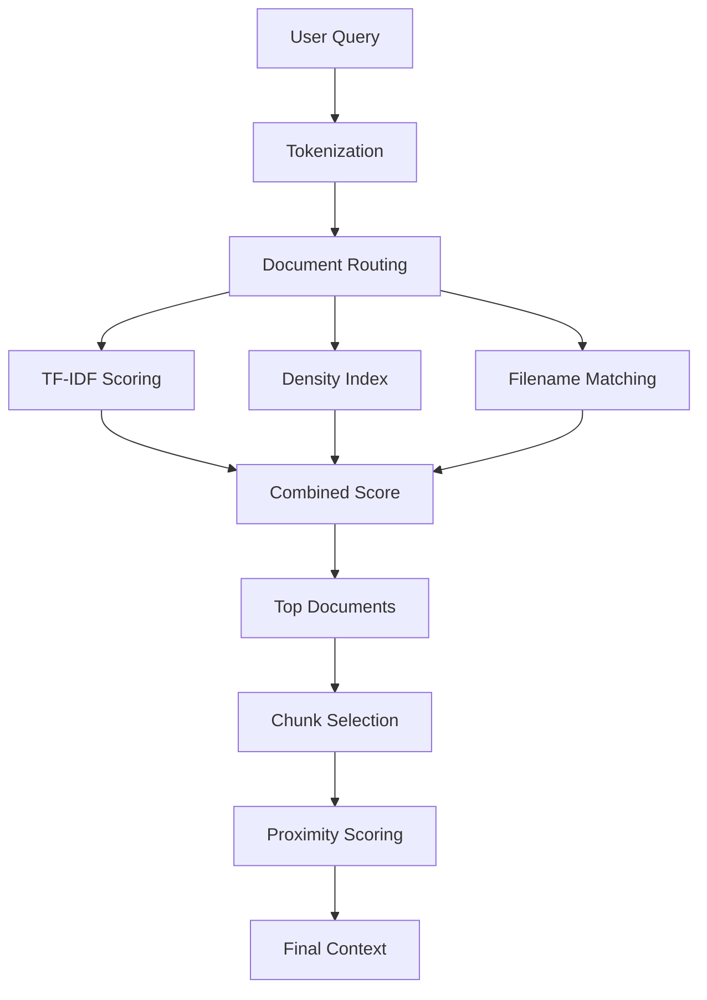

SIAA uses a sophisticated multi-level document retrieval system to find the most relevant documents for each query. The system combines TF-IDF scoring, density indexing, filename matching, and advanced chunk selection to deliver precise, context-aware responses.

## Overview

The intelligent retrieval system operates in two main phases:

1. **Document Routing**: Selects which documents are most relevant to the query
2. **Chunk Selection**: Extracts the most relevant sections from selected documents



## Tokenization

The tokenizer extracts meaningful terms from queries and documents using intelligent filtering rules.

### Token Rules

<CodeGroup>
```python siaa_proxy.py:577-616
def tokenizar(texto: str) -> list:
    """
    Tokenizador alfanumérico con reglas de filtrado inteligentes.

    [FIX-1] Incluye tokens con letras+dígitos (psaa16, pcsja19, art5).
    [FIX-4] Incluye números puros de 4+ dígitos (10476, 2016, 1096).
    """
    # Capturar tokens alfanuméricos (letras, dígitos, tildes)
    tokens_raw = re.findall(r'\b[a-záéíóúüñ0-9]{3,}\b', texto.lower())

    resultado = []
    for p in tokens_raw:
        if p in STOPWORDS_ES:
            continue
        es_solo_digitos = p.isdigit()
        if es_solo_digitos:
            # Solo incluir números con 4+ dígitos (años, códigos largos)
            if len(p) >= 4:
                resultado.append(p)
            # Descartar números cortos (1, 22, 999)
        else:
            # Token con letras (con o sin dígitos): incluir siempre
            resultado.append(p)

    return resultado
```
</CodeGroup>

<AccordionGroup>
  <Accordion title="Token Examples">
    | Input | Included? | Reason |
    |-------|-----------|--------|
    | `psaa16` | ✅ Yes | Alphanumeric with letters |
    | `10476` | ✅ Yes | 5 digits (document code) |
    | `2016` | ✅ Yes | 4 digits (year) |
    | `art5` | ✅ Yes | Alphanumeric with letters |
    | `42` | ❌ No | Only 2 digits |
    | `para` | ❌ No | Spanish stopword |
  </Accordion>
</AccordionGroup>

### Stopwords

The system filters common Spanish words that don't carry semantic meaning:

```python siaa_proxy.py:578-588
STOPWORDS_ES = {
    "para", "como", "este", "esta", "esto", "estos", "estas", "pero",
    "más", "también", "cuando", "donde", "porque", "aunque", "sino",
    "desde", "hasta", "entre", "sobre", "bajo", "ante", "tras",
    # ... 30+ stopwords total
}
```

## Document Routing Levels

### Level 1: TF-IDF Scoring

Combines automatically generated keywords with manually curated high-priority terms.

<CodeGroup>
```python siaa_proxy.py:618-644
def calcular_tfidf_coleccion(documentos: dict) -> dict:
    if not documentos:
        return {}
    tokens_por_doc = {n: tokenizar(d["contenido"]) for n, d in documentos.items()}
    N  = len(documentos)
    df = defaultdict(int)
    for tokens in tokens_por_doc.values():
        for t in set(tokens):
            df[t] += 1
    keywords_por_doc = {}
    for nombre, tokens in tokens_por_doc.items():
        if not tokens:
            keywords_por_doc[nombre] = []
            continue
        conteo       = Counter(tokens)
        total_tokens = len(tokens)
        scores       = {}
        for termino, freq in conteo.items():
            if freq < MIN_FREQ_KEYWORD or len(termino) < MIN_LEN_KEYWORD:
                continue
            tf  = freq / total_tokens
            idf = math.log((N + 1) / (df[termino] + 1)) + 1
            scores[termino] = tf * idf
        top = sorted(scores.keys(), key=lambda k: scores[k], reverse=True)
        keywords_por_doc[nombre] = top[:TOP_KEYWORDS_POR_DOC]
    return keywords_por_doc
```
</CodeGroup>

#### Manual Keywords

High-value documents receive manually curated keywords for improved routing:

```python siaa_proxy.py:866-909
KEYWORDS_MANUALES = {
    "acuerdo_pcsja19-11207..md": [
        "capacitacion", "capacita", "capacitar", "quien capacita",
        "cendoj", "udae", "unidad de desarrollo", "analisis estadistico",
    ],
    "acuerdo_no._psaa16-10476.md": [
        # Definition queries
        "que es sierju", "para que sirve", "objeto",
        # Periodicity and deadlines
        "periodicidad", "reportar", "quinto dia habil",
        # Roles (article 7)
        "roles", "super administrador", "funcionario",
        # Sanctions (articles 19-20)
        "sancion", "incumplimiento", "no reporto", "consecuencia",
    ],
}
```

<Note>
Manual keywords receive **2x weight** compared to auto-generated keywords to ensure critical documents surface for their key topics.
</Note>

### Level 2: Density Indexing

Builds an inverted index mapping terms to documents by density (term frequency / total tokens).

```python siaa_proxy.py:818-829
# Índice de densidad con tokens alfanuméricos
nuevo_indice = defaultdict(list)
for nombre_doc, doc in todos_los_docs.items():
    total = doc["total_tokens"]
    if total == 0:
        continue
    for termino, freq in doc["token_count"].items():
        if len(termino) >= MIN_LEN_KEYWORD:
            nuevo_indice[termino].append((freq / total, nombre_doc))

for t in nuevo_indice:
    nuevo_indice[t].sort(reverse=True)
```

**Example**: If "psaa16" appears 15 times in a 500-token document, density = 15/500 = 0.03

### Level 3: Filename Matching

Extracts tokens from filenames and matches against query terms.

```python siaa_proxy.py:723-728
def _tokens_nombre_archivo(nombre_clave: str) -> set:
    sin_ext = os.path.splitext(nombre_clave)[0]
    partes  = re.split(r'[_\s\-\.]+', sin_ext.lower())
    # [FIX-1] incluir partes que tengan dígitos (psaa16, 10476)
    return {p for p in partes if len(p) >= 3}
```

**Example**: `acuerdo_no._psaa16-10476.md` → tokens: `{"acuerdo", "psaa16", "10476"}`

### Combined Scoring

The three levels combine with weighted scores:

```python siaa_proxy.py:946-953
scores_combinados = defaultdict(float)
for doc, s in scores_tfidf.items():
    scores_combinados[doc] += s * 2.0      # TF-IDF weight
for doc, s in scores_densidad.items():
    scores_combinados[doc] += s * 1.0      # Density weight
for doc, s in scores_nombre.items():
    scores_combinados[doc] += s * 1.5      # Filename weight
```

<Card title="Routing Example" icon="route">
  **Query**: "¿Qué es el PSAA16?"
  
  **Routing scores**:
  - `acuerdo_no._psaa16-10476.md`: **18.4**
    - TF-IDF: 6.0 × 2.0 = 12.0 (manual keywords hit)
    - Filename: 2.0 × 1.5 = 3.0 ("psaa16" in name)
    - Density: 3.4 × 1.0 = 3.4
  - Other documents: < 2.0
</Card>

## Query Expansion

The system automatically expands queries with domain-specific terms based on question type.

### Expansion Strategies

<CodeGroup>
```python Definition Queries (siaa_proxy.py:1141-1154)
# "qué es", "para qué sirve", "describe"
if es_pregunta_definicion:
    palabras.update(["sistema", "herramienta", "plataforma", "estadístico",
                     "estadistico", "información", "informacion", "instrumento",
                     "judicial", "recolección", "recoleccion", "registro",
                     "datos", "inventario", "reportar", "objeto", "consiste"])
```

```python Temporal Queries (siaa_proxy.py:1155-1158)
# "cuándo", "plazo", "fecha"
if any(w in p_lower for w in ["cuándo", "cuando", "plazo", "fecha"]):
    palabras.update(["periodicidad", "plazo", "hábil", "habiles", "trimestre",
                     "vencimiento", "quinto", "corte", "periodo", "período"])
```

```python Sanction Queries (siaa_proxy.py:1203-1211)
# "qué pasa", "consecuencia", "sanción"
if any(w in p_lower for w in ["qué pasa", "que pasa", "consecuencia", "sanción"]):
    palabras.update(["sanción", "sancion", "disciplinaria", "incumplimiento",
                     "juramento", "veraz", "oportunamente", "acarreará"])
```
</CodeGroup>

<Tip>
Query expansion helps bridge the gap between natural language questions ("cuándo debo reportar") and technical document language ("periodicidad quincenal").
</Tip>

## Chunk Selection

Once documents are selected, the system scores individual chunks to find the most relevant passages.

### Chunk Scoring Algorithm

```python siaa_proxy.py:1017-1086
def puntuar_chunk(chunk: dict, palabras: set, pregunta_norm: str,
                  terminos_prio: set, idf_local: dict = None) -> float:
    texto  = chunk["texto"].lower()
    puntos = 0.0

    # TF-IDF scoring per word
    for w in palabras:
        count = texto.count(w)
        if count > 0:
            tf   = 1.0 + math.log(count)   # log-normalized
            base = 3.0 if w in terminos_prio else 1.0
            if idf_local and w in idf_local:
                base *= idf_local[w]
            puntos += tf * base

    # Exact query match: +15 points
    if pregunta_norm in texto:
        puntos += 15.0

    # Article with degree symbol: +10 points
    if PATRON_ARTICULO_GRADO.search(chunk["texto"]):
        puntos += 10.0
    elif PATRON_ARTICULO_SIMPLE.search(chunk["texto"]):
        puntos += 5.0

    # Numbered list: +4 points
    if re.search(r'^\s*\d+[\.\)]\s+\S', chunk["texto"], re.MULTILINE):
        puntos += 4.0

    # Proximity bonus ("Sharpshooter" strategy)
    if len(palabras) >= 2:
        VENTANA   = 150   # chars ≈ 1-2 short sentences
        max_densidad = 0.0
        for i in range(0, max(1, len(texto) - VENTANA), 50):
            v = texto[i:i+VENTANA]
            matches = sum(1 for w in palabras if w in v)
            if matches >= 2:
                d = matches / len(palabras)
                if d > max_densidad:
                    max_densidad = d
        
        if   max_densidad >= 0.90: puntos += 20.0  # 90%+ keywords together
        elif max_densidad >= 0.70: puntos += 12.0
        elif max_densidad >= 0.50: puntos +=  6.0
        elif max_densidad >= 0.30: puntos +=  2.0

    return puntos
```

### Priority Terms

Certain domain-specific terms receive boosted scoring:

```python siaa_proxy.py:983-993
TERMINOS_PRIORITARIOS_BASE = {
    "procedimiento", "pasos", "proceso", "tramite", "trámite",
    "requisito", "requisitos", "ingreso", "registro", "módulo",
    "sierju", "formulario", "artículo", "articulo",
    "plazo", "fecha", "periodicidad", "hábil", "trimestre",
    "reportar", "reporte", "publicación",
}
```

### Proximity Bonus: The "Sharpshooter" Strategy

The proximity scorer uses a sliding window to find regions where query keywords cluster together:

<Steps>
  <Step title="Slide 150-char window across chunk">
    Move in 50-char steps with 67% overlap
  </Step>
  
  <Step title="Count keyword matches in each window">
    Calculate density = matches / total_keywords
  </Step>
  
  <Step title="Award bonus based on max density">
    - ≥90% density: +20 points (exact answer)
    - ≥70% density: +12 points (very likely)
    - ≥50% density: +6 points (probable)
    - ≥30% density: +2 points (weak signal)
  </Step>
</Steps>

<Note>
**Why proximity matters**: A chunk with "incumplimiento disciplinario sanción reportar" in 120 chars gets density ≈1.0 and max bonus (+20), while the same words scattered across 800 chars gets density ≈0.25 and minimal bonus.
</Note>

### Position Bias for Definition Queries

Legal documents typically start with definitions. For "qué es" queries, early chunks receive a position bonus:

```python siaa_proxy.py:1258-1266
if es_pregunta_definicion and scored:
    scored_bias = []
    for pts, idx, chunk in scored:
        # Chunks 0-4: decreasing bonus (doc start = definitions)
        position_bonus = max(0.0, (5 - idx) * 3.0)
        scored_bias.append((pts + position_bonus, idx, chunk))
    scored_bias.sort(reverse=True)
    scored = scored_bias
```

## Adaptive Chunk Selection

### "Sharpshooter vs. Shotgun" Strategy

The system dynamically adjusts how many chunks to send based on score distribution:

```python siaa_proxy.py:1283-1302
if len(scored) >= 2:
    s1, s2 = scored[0][0], scored[1][0]
    ratio  = s1 / max(s2, 0.01)
    
    if es_listado:
        # List queries: minimum 2 chunks to capture all items
        chunks_a_usar = max_chunks_efectivo if ratio < 1.8 else 2
        modo = "LISTADO-BINÓCULO" if chunks_a_usar == 2 else "LISTADO-ESCOPETA"
    elif ratio >= 3.0:
        chunks_a_usar = 1   # High certainty → 1 chunk ≈200 tokens
        modo = "FRANCOTIRADOR"
    elif ratio >= 1.8:
        chunks_a_usar = 2   # Medium certainty → 2 chunks ≈400 tokens
        modo = "BINÓCULO"
    else:
        chunks_a_usar = max_chunks_efectivo   # Ambiguous → 3 chunks
        modo = "ESCOPETA"
```

<CardGroup cols={3}>
  <Card title="Sharpshooter" icon="bullseye">
    **1 chunk** (≈200 tokens)
    
    When ratio ≥ 3.0
    
    High confidence in single location
  </Card>
  
  <Card title="Binoculars" icon="binoculars">
    **2 chunks** (≈400 tokens)
    
    When ratio ≥ 1.8
    
    Medium confidence
  </Card>
  
  <Card title="Shotgun" icon="spray-can">
    **3 chunks** (≈600 tokens)
    
    When ratio < 1.8
    
    Ambiguous query
  </Card>
</CardGroup>

<Warning>
List queries ("cuáles son", "enumera") **always** use minimum 2 chunks, even with high ratio, because answers are distributed across multiple sections.
</Warning>

## Configuration

```python siaa_proxy.py:282-296
MAX_DOCS_CONTEXTO      = 2    # Maximum documents per query
TOP_KEYWORDS_POR_DOC   = 20   # Top TF-IDF keywords per document
MIN_FREQ_KEYWORD       = 2    # Minimum term frequency
MIN_LEN_KEYWORD        = 3    # Minimum term length

CHUNK_SIZE             = 800  # Maximum chars per chunk
CHUNK_OVERLAP          = 300  # Shared chars between chunks
MAX_CHUNKS_CONTEXTO    = 3    # Max chunks per document
```

## Performance Metrics

<CardGroup cols={2}>
  <Card title="Routing Accuracy" icon="crosshairs">
    Correct document selected: **>95%**
    
    Based on manual keyword tuning
  </Card>
  
  <Card title="Chunk Precision" icon="location-crosshairs">
    Relevant chunk in top 3: **>90%**
    
    With proximity scoring
  </Card>
  
  <Card title="Context Efficiency" icon="gauge-high">
    Tokens sent to model: **400-600**
    
    Down from 1200+ with fixed chunking
  </Card>
  
  <Card title="Response Speed" icon="bolt">
    Average query time: **&lt;30s**
    
    With adaptive chunk selection
  </Card>
</CardGroup>

## Diagnostic Endpoints

Test and debug the routing system:

### Test Document Routing

```bash
curl "http://localhost:5000/siaa/enrutar?q=consecuencias+por+no+reportar"
```

### View Document Keywords

```bash
curl "http://localhost:5000/siaa/keywords/acuerdo_no._psaa16-10476.md"
```

### Check Term Density

```bash
curl "http://localhost:5000/siaa/densidad/psaa16"
```

### View Selected Fragment

```bash
curl "http://localhost:5000/siaa/fragmento?doc=acuerdo_no._psaa16-10476.md&q=sanciones"
```

## Best Practices

<AccordionGroup>
  <Accordion title="Tuning Manual Keywords">
    Add manual keywords when:
    - Document is critical but uses non-standard terminology
    - Users frequently ask about a topic using different words than the document
    - TF-IDF misses important low-frequency terms
    
    Keywords receive **2x weight**, so choose carefully.
  </Accordion>
  
  <Accordion title="Adjusting Chunk Size">
    - **Smaller chunks** (600-800 chars): Better precision, faster responses
    - **Larger chunks** (1000-1200 chars): Better recall, may include context
    - Always maintain **CHUNK_OVERLAP ≥ 30%** of CHUNK_SIZE to avoid splitting related content
  </Accordion>
  
  <Accordion title="Query Expansion Patterns">
    Add expansion patterns when:
    - You notice consistent mismatches between user language and document language
    - A question type repeatedly fails to find relevant chunks
    - Domain terminology is highly specialized
    
    Target **10-15 expansion terms** per question type.
  </Accordion>
</AccordionGroup>