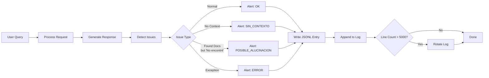

SIAA includes a comprehensive quality monitoring system that logs every query in a structured JSONL (JSON Lines) format. The system automatically detects potential issues, tracks performance metrics, and provides endpoints for analysis.

## Overview

Each query generates a single-line JSON entry with:

- Timestamp and query type
- Question and response preview
- Documents used and context size
- Response time
- Automatic issue detection (hallucinations, errors)



## Log Configuration

```python siaa_proxy.py:203-205
LOG_ARCHIVO    = "/opt/siaa/logs/calidad.jsonl"   # One JSON line per query
LOG_MAX_LINEAS = 5000   # Rotate when reaching 5000 entries (~2MB)
_log_lock      = threading.Lock()
```

<ParamField path="LOG_ARCHIVO" type="string" default="/opt/siaa/logs/calidad.jsonl">
  Path to the JSONL log file. Each line is a complete JSON object.
</ParamField>

<ParamField path="LOG_MAX_LINEAS" type="int" default="5000">
  Maximum lines before log rotation. When exceeded, keeps last 4000 lines.
</ParamField>

## JSONL Format

Each log entry is a single line of JSON:

```json
{"ts":"2026-03-08T14:23:45","tipo":"DOC","alerta":"OK","pregunta":"cuando debo reportar al sierju","respuesta":"Debe reportar antes del quinto día hábil de cada mes según el artículo 3 del PSAA16-10476.","docs":["acuerdo_no._psaa16-10476.md"],"ctx_chars":2400,"tiempo_s":28.3}
```

### Entry Structure

<ResponseField name="ts" type="string" required>
  ISO 8601 timestamp: `YYYY-MM-DDTHH:MM:SS`
</ResponseField>

<ResponseField name="tipo" type="string" required>
  Query type:
  - `CONV`: Conversational (greetings, general chat)
  - `DOC`: Document query
  - `CACHE_HIT`: Served from cache
  - `ERROR`: Exception occurred
</ResponseField>

<ResponseField name="alerta" type="string" required>
  Issue detection result:
  - `OK`: Normal operation
  - `SIN_CONTEXTO`: No documents found (correct to say "no encontré")
  - `POSIBLE_ALUCINACION`: Had documents but model said "no encontré"
  - `ERROR`: Processing error
</ResponseField>

<ResponseField name="pregunta" type="string" required>
  First 200 characters of the user's question
</ResponseField>

<ResponseField name="respuesta" type="string" required>
  First 300 characters of the AI's response
</ResponseField>

<ResponseField name="docs" type="array" required>
  List of document filenames used (empty for conversational or cache hits)
</ResponseField>

<ResponseField name="ctx_chars" type="int" required>
  Total characters of context sent to the model (0 for cache hits)
</ResponseField>

<ResponseField name="tiempo_s" type="float" required>
  Response time in seconds (0.0 for cache hits)
</ResponseField>

## Logging Function

<CodeGroup>
```python siaa_proxy.py:213-275
def registrar_consulta(
    tipo: str,          # "CONV", "DOC", "CACHE_HIT", "ERROR"
    pregunta: str,
    respuesta: str,
    docs: list,
    ctx_chars: int,
    tiempo_seg: float,
    cache_hit: bool = False,
):
    """
    Escribe una línea JSONL en el archivo de log de calidad.

    Detecta automáticamente posibles problemas:
      - POSIBLE_ALUCINACION: el modelo respondió "No encontré" pero SÍ había
        documentos relevantes (el extractor encontró contexto pero el modelo
        lo ignoró o el contexto era incorrecto).
      - SIN_CONTEXTO: pregunta documental sin documentos encontrados.
    """
    try:
        _asegurar_carpeta_log()

        # Automatic issue detection
        no_encontro  = "no encontré esa información" in respuesta.lower()
        habia_docs   = len(docs) > 0 and ctx_chars > 100

        if no_encontro and habia_docs:
            alerta = "POSIBLE_ALUCINACION"   # Had docs but said "no encontré"
        elif no_encontro and not habia_docs:
            alerta = "SIN_CONTEXTO"           # No docs — correct to say "no encontré"
        elif tipo == "ERROR":
            alerta = "ERROR"
        else:
            alerta = "OK"

        entrada = {
            "ts":        time.strftime("%Y-%m-%dT%H:%M:%S"),
            "tipo":      "CACHE_HIT" if cache_hit else tipo,
            "alerta":    alerta,
            "pregunta":  pregunta[:200],
            "respuesta": respuesta[:300],
            "docs":      docs,
            "ctx_chars": ctx_chars,
            "tiempo_s":  round(tiempo_seg, 2),
        }

        with _log_lock:
            # Rotate if exceeds maximum
            try:
                with open(LOG_ARCHIVO, "r", encoding="utf-8") as f:
                    lineas = f.readlines()
                if len(lineas) >= LOG_MAX_LINEAS:
                    # Keep last 4000 lines
                    with open(LOG_ARCHIVO, "w", encoding="utf-8") as f:
                        f.writelines(lineas[-4000:])
            except FileNotFoundError:
                pass  # First write

            with open(LOG_ARCHIVO, "a", encoding="utf-8") as f:
                f.write(json.dumps(entrada, ensure_ascii=False) + "\n")

    except Exception as e:
        print(f"[LOG] Error escribiendo log: {e}", flush=True)
```
</CodeGroup>

## Hallucination Detection

The system automatically identifies potential hallucinations using this logic:

### Detection Rules

<Steps>
  <Step title="Check if response is negative">
    Does response contain `"no encontré esa información"`?
  </Step>
  
  <Step title="Check if context was available">
    Were documents selected AND was context &gt;100 chars?
  </Step>
  
  <Step title="Classify based on combination">
    | Response | Context Available | Classification |
    |----------|------------------|----------------|
    | "No encontré" | Yes (docs + 100+ chars) | `POSIBLE_ALUCINACION` ⚠️ |
    | "No encontré" | No (no docs or &lt;100 chars) | `SIN_CONTEXTO` ✅ |
    | Has answer | Yes | `OK` ✅ |
    | Has answer | No | `OK` (conversational) ✅ |
  </Step>
</Steps>

### Why This Matters

<Card title="False Negative Detection" icon="triangle-exclamation">
  **Scenario**: User asks "¿Qué dice el artículo 5 del PSAA16?"
  
  **System behavior**:
  1. ✅ Router finds `acuerdo_no._psaa16-10476.md`
  2. ✅ Extractor selects chunks containing artículo 5
  3. ✅ Sends 2400 chars of context to model
  4. ❌ Model responds: "No encontré esa información"
  
  **Alert**: `POSIBLE_ALUCINACION`
  
  **Cause**: Model failed to extract answer from valid context (needs prompt tuning or chunk selection improvement)
</Card>

<Card title="True Negative (Correct)" icon="circle-check">
  **Scenario**: User asks "¿Qué es el XYZABC123?"
  
  **System behavior**:
  1. ❌ Router finds no matching documents
  2. ⏭️ Extractor skipped (no docs)
  3. ⏭️ No context sent to model
  4. ✅ Model responds: "No encontré esa información"
  
  **Alert**: `SIN_CONTEXTO`
  
  **Cause**: Legitimate "not found" — no documents match query
</Card>

## Log Rotation

When the log exceeds `LOG_MAX_LINEAS`, it automatically rotates:

```python siaa_proxy.py:258-267
# Rotate if exceeds maximum
try:
    with open(LOG_ARCHIVO, "r", encoding="utf-8") as f:
        lineas = f.readlines()
    if len(lineas) >= LOG_MAX_LINEAS:
        # Keep last 4000 lines
        with open(LOG_ARCHIVO, "w", encoding="utf-8") as f:
            f.writelines(lineas[-4000:])
except FileNotFoundError:
    pass  # First write
```

**Rotation behavior**:
- Trigger: 5000 lines (~2 MB)
- Action: Keep most recent 4000 lines
- Result: Log shrinks by 20%, keeps recent history

<Warning>
Old entries are **permanently deleted** during rotation. Archive the log file externally if you need long-term history.
</Warning>

## Accessing Logs

### View Recent Entries

```bash
curl "http://localhost:5000/siaa/log?n=50"
```

Response:
```json
{
  "resumen": {
    "total_consultas": 847,
    "errores": 3,
    "posibles_alucinaciones": 12,
    "cache_hits": 243,
    "tiempo_promedio_s": 26.4
  },
  "entradas": [
    {
      "ts": "2026-03-08T14:23:45",
      "tipo": "DOC",
      "alerta": "OK",
      "pregunta": "cuando debo reportar al sierju",
      "respuesta": "Debe reportar antes del quinto día hábil...",
      "docs": ["acuerdo_no._psaa16-10476.md"],
      "ctx_chars": 2400,
      "tiempo_s": 28.3
    }
  ],
  "mostrando": 50
}
```

### Filter by Alert Type

```bash
# Show only hallucinations
curl "http://localhost:5000/siaa/log?alerta=POSIBLE_ALUCINACION"

# Show only errors
curl "http://localhost:5000/siaa/log?alerta=ERROR"

# Show only successful queries
curl "http://localhost:5000/siaa/log?alerta=OK"
```

### Filter by Query Type

```bash
# Show only cache hits
curl "http://localhost:5000/siaa/log?tipo=CACHE_HIT"

# Show only document queries
curl "http://localhost:5000/siaa/log?tipo=DOC"

# Show only conversational queries
curl "http://localhost:5000/siaa/log?tipo=CONV"
```

### Plain Text Format

```bash
curl "http://localhost:5000/siaa/log?formato=txt&n=20"
```

Output:
```
=== Log SIAA — últimas 20 de 847 consultas ===
Errores: 3 | Posibles alucinaciones: 12 | Cache hits: 243 | T.prom: 26.4s

[2026-03-08T14:23:45] DOC 28.3s
  P: cuando debo reportar al sierju
  R: Debe reportar antes del quinto día hábil de cada mes según el artículo 3...
  Docs: ['acuerdo_no._psaa16-10476.md']

[2026-03-08T14:22:10] ⚠ [POSIBLE_ALUCINACION] DOC 31.2s
  P: que dice el articulo 7 sobre roles
  R: No encontré esa información en los documentos disponibles.
  Docs: ['acuerdo_no._psaa16-10476.md']
```

## Log Endpoint Reference

<CodeGroup>
```python siaa_proxy.py:1928-2014
@app.route("/siaa/log", methods=["GET"])
def ver_log():
    """
    Muestra las últimas N entradas del log de calidad.

    Parámetros URL:
      ?n=50          → últimas N consultas (máx 500, defecto 50)
      ?tipo=ERROR    → filtrar por tipo: OK, ERROR, POSIBLE_ALUCINACION, etc.
      ?alerta=OK     → filtrar por alerta
      ?formato=txt   → salida en texto plano (más fácil de leer en terminal)

    Ejemplo: curl http://localhost:5000/siaa/log?n=20&alerta=POSIBLE_ALUCINACION
    """
    try:
        n       = min(int(request.args.get("n", 50)), 500)
        filtro_tipo   = request.args.get("tipo", "").upper()
        filtro_alerta = request.args.get("alerta", "").upper()
        fmt     = request.args.get("formato", "json")

        # ... read and parse log file ...

        # Calculate summary
        todas_lineas = [json.loads(l) for l in lineas if l.strip()]
        total   = len(todas_lineas)
        errores = sum(1 for e in todas_lineas if e.get("alerta") == "ERROR")
        alucs   = sum(1 for e in todas_lineas if e.get("alerta") == "POSIBLE_ALUCINACION")
        hits    = sum(1 for e in todas_lineas if e.get("tipo") == "CACHE_HIT")
        t_prom  = round(
            sum(e.get("tiempo_s", 0) for e in todas_lineas if e.get("tiempo_s", 0) > 0) /
            max(sum(1 for e in todas_lineas if e.get("tiempo_s", 0) > 0), 1), 1
        )

        return jsonify({
            "resumen": {
                "total_consultas":        total,
                "errores":                errores,
                "posibles_alucinaciones": alucs,
                "cache_hits":             hits,
                "tiempo_promedio_s":      t_prom,
            },
            "entradas": entradas,
            "mostrando": len(entradas),
        })
```
</CodeGroup>

### Query Parameters

<ParamField query="n" type="int" default="50">
  Number of recent entries to return (max 500)
</ParamField>

<ParamField query="tipo" type="string">
  Filter by query type: `CONV`, `DOC`, `CACHE_HIT`, `ERROR`
</ParamField>

<ParamField query="alerta" type="string">
  Filter by alert level: `OK`, `SIN_CONTEXTO`, `POSIBLE_ALUCINACION`, `ERROR`
</ParamField>

<ParamField query="formato" type="string" default="json">
  Output format: `json` or `txt`
</ParamField>

## Quality Metrics

The summary provides key performance indicators:

<CardGroup cols={2}>
  <Card title="Total Queries" icon="hashtag">
    Total number of logged queries since last rotation
  </Card>
  
  <Card title="Error Rate" icon="circle-exclamation">
    `errores / total_consultas`
    
    Should be &lt;1%
  </Card>
  
  <Card title="Hallucination Rate" icon="brain">
    `posibles_alucinaciones / total_consultas`
    
    Target: &lt;5%
  </Card>
  
  <Card title="Cache Hit Rate" icon="gauge-high">
    `cache_hits / total_consultas`
    
    Expected: 30-40%
  </Card>
  
  <Card title="Avg Response Time" icon="stopwatch">
    Average `tiempo_s` for non-cache queries
    
    Target: &lt;30s
  </Card>
</CardGroup>

## Analyzing Logs

### Using jq (Command Line)

```bash
# Count queries by type
cat /opt/siaa/logs/calidad.jsonl | jq -r '.tipo' | sort | uniq -c

# Find slowest queries
cat /opt/siaa/logs/calidad.jsonl | jq -r '[.pregunta, .tiempo_s] | @tsv' | sort -k2 -rn | head -10

# Find all hallucinations
cat /opt/siaa/logs/calidad.jsonl | jq 'select(.alerta == "POSIBLE_ALUCINACION")'

# Average response time by document
cat /opt/siaa/logs/calidad.jsonl | jq -r '[.docs[0], .tiempo_s] | @tsv' | awk '{sum[$1]+=$2; count[$1]++} END {for (doc in sum) print doc, sum[doc]/count[doc]}'
```

### Using Python

```python
import json
from collections import Counter, defaultdict

# Load log
with open('/opt/siaa/logs/calidad.jsonl') as f:
    logs = [json.loads(line) for line in f]

# Alert distribution
alert_counts = Counter(log['alerta'] for log in logs)
print(f"Alerts: {alert_counts}")

# Hallucination analysis
hallu = [log for log in logs if log['alerta'] == 'POSIBLE_ALUCINACION']
hallu_docs = Counter(doc for log in hallu for doc in log['docs'])
print(f"Most hallucination-prone docs: {hallu_docs.most_common(5)}")

# Response time by hour
from datetime import datetime
times_by_hour = defaultdict(list)
for log in logs:
    if log['tiempo_s'] > 0:
        hour = datetime.fromisoformat(log['ts']).hour
        times_by_hour[hour].append(log['tiempo_s'])

avg_by_hour = {h: sum(times)/len(times) for h, times in times_by_hour.items()}
print(f"Avg response time by hour: {avg_by_hour}")
```

### Excel Analysis

1. Load the JSONL file into Excel using Power Query
2. Expand the JSON columns
3. Create pivot tables:
   - Alert type distribution
   - Response time trends over time
   - Most queried documents
   - Cache hit rate by hour

## Integration with Monitoring Tools

### Prometheus/Grafana

Export metrics from the log:

```python
# metrics_exporter.py
import json
from prometheus_client import Counter, Histogram, Gauge, start_http_server

query_total = Counter('siaa_queries_total', 'Total queries', ['tipo', 'alerta'])
response_time = Histogram('siaa_response_seconds', 'Response time')

with open('/opt/siaa/logs/calidad.jsonl') as f:
    for line in f:
        log = json.loads(line)
        query_total.labels(tipo=log['tipo'], alerta=log['alerta']).inc()
        if log['tiempo_s'] > 0:
            response_time.observe(log['tiempo_s'])

start_http_server(8000)
```

### ELK Stack (Elasticsearch + Kibana)

Ship logs with Filebeat:

```yaml
# filebeat.yml
filebeat.inputs:
  - type: log
    enabled: true
    paths:
      - /opt/siaa/logs/calidad.jsonl
    json.keys_under_root: true
    json.add_error_key: true

output.elasticsearch:
  hosts: ["localhost:9200"]
  index: "siaa-logs-%{+yyyy.MM.dd}"
```

## Best Practices

<AccordionGroup>
  <Accordion title="Monitoring Hallucinations">
    **Daily review**: Check for `POSIBLE_ALUCINACION` entries
    
    ```bash
    # Daily report
    curl "http://localhost:5000/siaa/log?alerta=POSIBLE_ALUCINACION&n=100"
    ```
    
    **Common causes**:
    - Chunk selection misses relevant content → tune query expansion
    - Model prompt needs refinement → update `SYSTEM_DOCUMENTAL`
    - Document formatting confuses parser → improve chunking
    
    **Fix strategy**:
    1. Identify the query that triggered hallucination
    2. Check what chunks were selected: `/siaa/fragmento?doc=X&q=Y`
    3. Verify chunks contain the answer
    4. If yes: improve prompt; if no: improve chunk scoring
  </Accordion>
  
  <Accordion title="Performance Analysis">
    **Track slowest queries**:
    
    ```bash
    cat /opt/siaa/logs/calidad.jsonl | \
      jq -r '[.pregunta, .tiempo_s, .docs[0]] | @tsv' | \
      sort -k2 -rn | head -20
    ```
    
    **Optimization targets**:
    - Queries &gt;45s: Check if documents are too large or chunks excessive
    - Queries &lt;15s: Ideal range
    - Queries &lt;1s: Likely cache hits
    
    **Common issues**:
    - Large context (>3000 chars): Reduce `MAX_CHUNKS_CONTEXTO`
    - Slow routing: Add manual keywords for common queries
    - Slow model inference: Consider smaller model or quantization
  </Accordion>
  
  <Accordion title="Log Rotation Strategy">
    **For production deployments**:
    
    1. Archive before rotation:
    ```bash
    # Daily cron job
    cp /opt/siaa/logs/calidad.jsonl \
       /opt/siaa/archive/calidad-$(date +%Y%m%d).jsonl
    ```
    
    2. Compress old archives:
    ```bash
    gzip /opt/siaa/archive/calidad-*.jsonl
    ```
    
    3. Delete archives &gt;90 days:
    ```bash
    find /opt/siaa/archive -name '*.jsonl.gz' -mtime +90 -delete
    ```
  </Accordion>
</AccordionGroup>

## Troubleshooting

### High Hallucination Rate (>10%)

<Steps>
  <Step title="Check document coverage">
    Are users asking about topics not in your documents?
    
    ```bash
    # Find queries with SIN_CONTEXTO
    curl "http://localhost:5000/siaa/log?alerta=SIN_CONTEXTO" | jq -r '.entradas[].pregunta'
    ```
  </Step>
  
  <Step title="Review chunk selection">
    For hallucinated queries, verify selected chunks:
    
    ```bash
    curl "http://localhost:5000/siaa/fragmento?doc=X&q=Y"
    ```
    
    Do chunks contain the answer? If no, improve routing/scoring.
  </Step>
  
  <Step title="Tune system prompt">
    Model may be too conservative. Try adjusting `SYSTEM_DOCUMENTAL`:
    
    ```python
    # siaa_proxy.py:325-341
    SYSTEM_DOCUMENTAL = """...
    5. Solo si el contexto es completamente ajeno al tema → responde: "No encontré..."
    
    # Consider changing to:
    5. Si encontraste información aunque sea parcial → responde con ella.
       Si el contexto habla del tema en términos generales, explica eso.
       Solo si el contexto es 100% ajeno → responde: "No encontré..."
    """
    ```
  </Step>
</Steps>

### Log File Growing Too Fast

**Symptom**: Rotation happening multiple times per day

**Solutions**:
- Increase `LOG_MAX_LINEAS` to 10000-20000
- Reduce logging verbosity (truncate longer responses)
- Archive more frequently

### Missing Log Entries

**Symptom**: Some queries don't appear in log

**Causes**:
- Exception in logging function (check server logs)
- Disk full (check `df -h /opt/siaa`)
- Permission issues (check file ownership)

**Fix**:
```bash
# Ensure log directory exists with correct permissions
sudo mkdir -p /opt/siaa/logs
sudo chown -R siaa:siaa /opt/siaa/logs
sudo chmod 755 /opt/siaa/logs
```